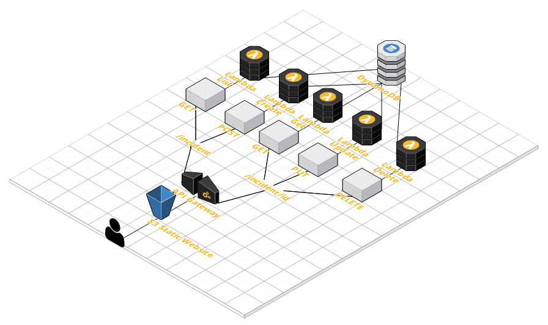

# Incident Management System

Fullstack Serverless Application on AWS

## Architecture



## AWS IAM

```
aws configure --profile mycli
```

## Amazon DynamoDB

```
aws dynamodb create-table \
    --table-name Incidents \
    --attribute-definitions AttributeName=IncidentTitle, AttributeType=S AttributeName=IncidentDate,AttributeType=S,
    --key-schema AttributeName=IncidentTitle,KeyType=HASH AttributeName=IncidentName,KeyType=Range
    --tags Key="Project" Value="Incident Management System"
```

## AWS Lambda

### Create AWS Lambda Functions

```
aws lambda create-function --function-name createIncident \
    --runtime nodejs12.x \
    --role arn:aws:iam:0123456789012:role/DynamoDBFullLambdaAccess \
    --handler createIncident.create \
    --zip-file fileb://createIncident.zip
```

```
aws lambda create-function --function-name getIncident \
    --runtime nodejs12.x \
    --role arn:aws:iam:0123456789012:role/DynamoDBFullLambdaAccess \
    --handler getIncident.get \
    --zip-file fileb://getIncident.zip
```

```
aws lambda create-function --function-name updateIncident \
    --runtime nodejs12.x \
    --role arn:aws:iam:0123456789012:role/DynamoDBFullLambdaAccess \
    --handler updateIncident.update \
    --zip-file fileb://updateIncident.zip
```

```
aws lambda create-function --function-name listIncidents \
    --runtime nodejs12.x \
    --role arn:aws:iam:0123456789012:role/DynamoDBFullLambdaAccess \
    --handler listIncidents.list \
    --zip-file fileb://listIncidents.zip
```

```
aws lambda create-function --function-name deleteIncident \
    --runtime nodejs12.x \
    --role arn:aws:iam:0123456789012:role/DynamoDBFullLambdaAccess \
    --handler deleteIncident.delete \
    --zip-file fileb://deleteIncident.zip
```

### Test Lambda Functions

```
aws dynamodb get-item --table-name Incidents \
    --key '{"IncidentTitle": {"S":"Tornado in Tulsa","IncidentDate":{"S": "2020-07-23"}}'
```

```
aws lambada invoke --function-name updateIncident \
    --payload file://updateTest.json \
    updateOutfile.txt
```

```
aws lambda invoke --function-name listIncidents \
    --payload '{}' \
    --listOutfile.txt
```

```
aws lambada invoke --function-name deleteIncident \
    --payload file://deleteTest.json \
    deleteOutfile.txt
```

## Amazon API Gateway

## Amazon S3
[Development Website](http://djs-incident-management-system.s3-website-us-east-1.amazonaws.com)

## Built With

* [Visual Studio Code](https://code.visualstudio.com) - Source Code Editor
* [Amazon Web Services](https://aws.amazon.com) - Cloud Computing Services
* [Amazon DynamoDB Developer Guide](https://docs.aws.amazon.com/amazondynamodb/latest/developerguide/GettingStarted.NodeJs.html) - Getting Started with Node.js and DynamoDB

## Authors

* **Daniel J. Sablosky** - *Initial work* - [Portfolio](https://portfolio.djsablosky.info)

## License

This project is licensed under the GNU General Public License - see the [LICENSE.md](LICENSE.md) file for details

## Acknowledgements

* [Linux Academy](https://linuxacademy.com) - Fullstack Serverless Applications on AWS